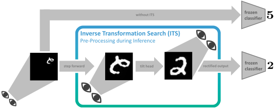
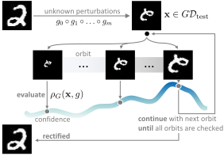
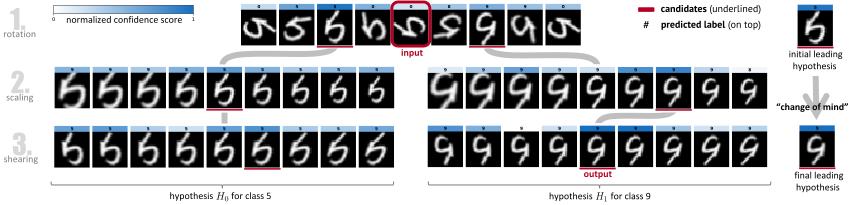

# Inverse Transformation Search (ITS)



This is the official repository of the paper:
"[Tilt your Head: Activating the Hidden Spatial-Invariance of Classifiers](https://arxiv.org/abs/2405.03730)" 
published as a main-conference paper at the ICML 2024 in Vienna.
You can find more information [here](https://icml.cc/virtual/2024/poster/34980).
Check out our [video recording](https://www.youtube.com/watch?v=S5lt50eEZQM&t=39s)
and our [poster](https://icml.cc/media/PosterPDFs/ICML%202024/34980.png?t=1719386790.1000016).
For questions or comments reach out to us via [LinkedIn](https://www.linkedin.com/in/johann-schmidt/)
or via `johann.schmidt@ovgu.de`.

## Abstract
Deep neural networks are applied in more and more areas of everyday life. 
However, they still lack essential abilities, such as robustly dealing with 
spatially transformed input signals. Approaches to mitigate this severe robustness 
issue are limited to two pathways: Either models are implicitly regularised by 
increased sample variability (data augmentation) or explicitly constrained by 
hard-coded inductive biases. The limiting factor of the former is the size of 
the data space, which renders sufficient sample coverage intractable. 
The latter is limited by the engineering effort required to develop such 
inductive biases for every possible scenario. Instead, we take inspiration 
from human behaviour, where percepts are modified by mental or physical actions 
during inference. We propose a novel technique to emulate such an inference process 
for neural nets. This is achieved by traversing a sparsified inverse transformation 
tree during inference using parallel energy-based evaluations. 
Our proposed inference algorithm, called Inverse Transformation Search (ITS), 
is model-agnostic and equips the model with zero-shot pseudo-invariance to 
spatially transformed inputs. We evaluated our method on several benchmark datasets,
including a synthesised ImageNet test set. ITS outperforms the utilised baselines 
on all zero-shot test scenarios.



## Installation
First, clone this repository.
Once inside the repository folder (`cd ITS`), you install it by running
```
pip install . 
```
Note that this installs `torch` for `Python >= 3.8` and `CUDA == 11.8`. 
You can check your current `CUDA` version using `nvcc --version`.
If the version differs, either change the `setup.py` manually 
or reinstall `torch` for your setup (find more details 
[here](https://pytorch.org/get-started/locally/)).

Furthermore, the `setup.py` ensures that the entire project is executable, 
hence it also contains a `jupyter` instance.
If this is not required, feel free to remove it from the package list.

A complete list of all requirements can be found [here](./requirements.txt).
You can also install from ITS using
```
python -m pip install -r requirements.txt
```

## Example Notebooks



Under the [examples](./examples) folder you find `jupyter notebooks` that help you getting started.
We recommend the following reading order:

- [(F)MNIST](./examples/(f)mnist.ipynb)
- more to follow soon

## Console Usage

To benchmark `ITS` we suggest using the console interface:
```
python its.py
    
  --gpu GPU             GPU index to use (default: 0)
  --transformations {rotation,scaling,shearing,translation} [{rotation,scaling,shearing,translation} ...]
                        List of transformations to apply.
  --domains DOMAINS [DOMAINS ...]
                        List of domains for each transformation.
  --n_samples N_SAMPLES
                        Number of samples (default: 17)
  --model_path MODEL_PATH
                        Path to the model file (default: ./model/mnist.pth)
  --test_set_loader_path TEST_SET_LOADER_PATH
                        Path to the test set loader file (default: ./data/mnist/test_loader.pickle)
  --dataset {mnist,fmnist}
                        Dataset to use (default: mnist)
  --n_hypotheses N_HYPOTHESES
                        Number of hypotheses (default: 3)
  --mc_steps MC_STEPS   Number of Monte Carlo steps (default: 10)
  --batch_size BATCH_SIZE
                        The batch size used for testing. (default: 128)
  --change_of_mind {score,off}
                        Criterion for change of mind (default: 'score')
  --en_unique_class_condition EN_UNIQUE_CLASS_CONDITION
                        Enable unique class condition (default: True)
```
The default setup (without passing any arguments) starts ITS on MNIST and returns the mean accuracy like
```
Mean accuracy on the transformed test set [with ITS]: 0.771.
```

## Bibtex
If you find our work interesting, please cite us.
```
@inproceedings{Schmidt2024,
  title={Tilt your Head: Activating the Hidden Spatial-Invariance of Classifiers},
  author={Johann Schmidt and Sebastian Stober},
  booktitle={International Conference on Machine Learning (ICML)},
  year={2024}
}
```